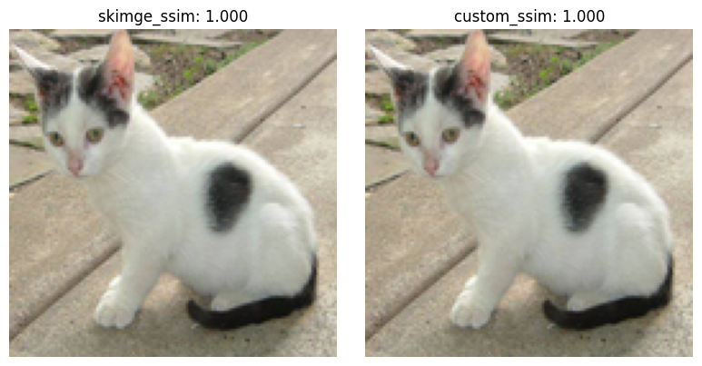
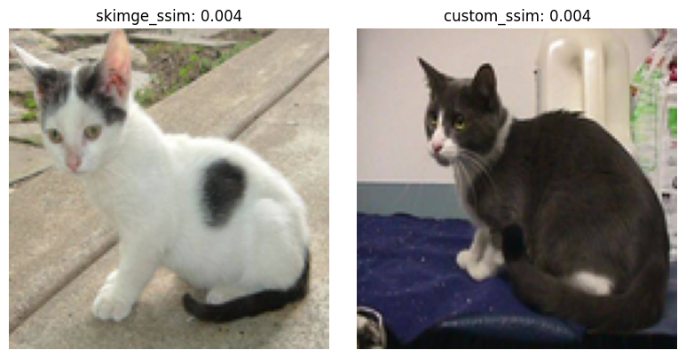

---

# 3D CT Resample

이 레포에서는 skimage와 값이 동일하게 나오는 ssim, psnr을 구현하였으며,
이를 활용하여 ssim, psnr 을 loss로 사용하실 수 있습니다.

### Same SSIM

  

### Diff SSIM

  

### Usage
   `check_psnr_pytorch_consistency_check.ipynb` 와 `check_ssim_pytorch_consistency_check.ipynb` 두개의 notebook 을 확인하시어 값이 일치하는지 직접 확인해보세요!
   `ssim_psnr.get_ssim` 과 `ssim_psnr.get_psnr` 으로 ssim과 psnr을 계산할 수 있습니다.

### Contact

If you have any questions or suggestions, feel free to reach out via:  
📧 **Email**: tobeor3009@gmail.com  
💬 **GitHub Issues**

--- 

Let me know if you need further refinements! 😊
